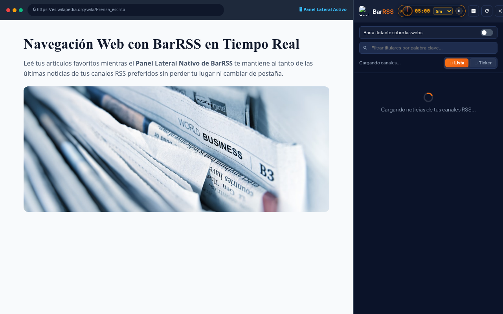

# BarRSS - El Diario Digital & Lector RSS (Manifest V3)

Extensión para **Google Chrome** con arquitectura centrada en la lectura: **El Diario Digital** como centro principal de noticias RSS en vivo, junto a soporte de panel lateral nativo y ticker marquesina flotante opcional.

---

## 📸 Capturas de Pantalla & Experiencia Visual

> *Todas las capturas están calibradas en resolución estándar de **1280 × 800 px**, listas para visualización en GitHub y para carga directa en el **Chrome Web Store Developer Dashboard**.*

### 📰 1. El Diario Digital: Portada Principal & Modo Noche
| 📰 Modo Papel Prensa (Portada Broadsheet) | 🌙 Modo Noche Editorial (Lectura Nocturna) |
| :---: | :---: |
|  |  |

### ⚙️ 2. Configuración Avanzada & Selector de Temas
| ⚙️ Catálogo de 20 Países (Sin Scroll Horizontal) | 🎨 Menú Desplegable de 7 Estilos Editoriales |
| :---: | :---: |
|  |  |

### 👑 3. Midnight Elegance & Panel Lateral Nativo
| 👑 Modo Midnight Elegance (Alta Costura) | 🖥️ Panel Lateral Nativo de Chrome (Side Panel) |
| :---: | :---: |
|  |  |

---

## 🌟 Tres Experiencias de Lectura

### Modo 1: 📰 El Diario Digital (Lector Principal)
- **Experiencia Editorial Completa:** Maquetación limpia tipo periódico broadsheet con noticia principal (*Hero story*) y grilla de artículos balanceada.
- **7 Estilos y Tipografías Editoriales:** Papel Prensa (Playfair), Noche Editorial (Merriweather), Sepia Vintage (EB Garamond), Financial Salmón (Newsreader), Nórdico Minimal (Space Grotesk), Terminal Cyberpunk (JetBrains Mono) y Midnight Elegance (Cormorant Garamond).
- **Apertura Versátil:** Podés abrirlo en una **pestaña de Chrome** o como **ventana independiente dedicada (App)** sin barras de navegación.
- **Auto-Actualización:** Contador inteligente con refresco automático cada 5 minutos y botón de pausa.
- **Favoritos / Guardados:** Marcador para guardar artículos y leerlos más tarde.
- **Búsqueda Instantánea & Filtro de Secciones:** Noticias, Economía, Tecnología, Deportes, Internacional, Show y Favoritos.

### Modo 2: 🖥️ Panel Lateral Nativo de Chrome (Side Panel)
- **100% Integrado en el navegador:** Se abre a la derecha de Chrome, totalmente **fuera del DOM de las páginas**.
- **Cero interferencia:** Imposible que tape menús, encabezados o botones de ninguna web.
- **Persistente:** Permanece abierto y activo mientras navegás y cambiás de pestaña.
- **Dos vistas:** Modo lista de tarjetas o ticker vertical continuo con buscador instantáneo.

### Modo 3: 🌊 Barra Flotante Opcional (Desactivada por defecto)
- **Completamente Opcional:** Viene desactivada por defecto para no invadir tu navegación web, pudiendo activarla cuando quieras desde la configuración.
- **Aislamiento Shadow DOM:** Mimetizado con la web (Modo Camaleón) y velocidad calibrada.

---

## 📡 Múltiples Fuentes & Favicons Oficiales

- **Selección Múltiple:** Podés activar varios canales simultáneamente (Infobae, El Cronista, Xataka, ESPN, BBC Mundo, etc.).
- **Mezcla Equitativa (Round-Robin):** Las noticias se intercalan de manera uniforme para ofrecer variedad de categorías.
- **Canales Propios:** Agregá cualquier URL de feed RSS o Atom con nombre personalizado.
- **Favicons Reales + Fallback a RSS:** Cada titular muestra el logo oficial del medio o el ícono RSS si no está disponible.

---

## 📁 Estructura del Proyecto

```text
BarRss/
├── manifest.json      # Manifest V3 con permisos de storage, tabs y sidePanel
├── background.js       # Service Worker: descargas limitadas, caché persistente y estado por canal
├── shared.js           # URLs, validación y almacenamiento compartidos
├── feed-parser.js      # Adaptador RSS/Atom del parser XML
├── vendor/             # sax-js empaquetado y su licencia
├── reader-features.js  # Estado leído/no leído y diagnóstico de canales
├── image-fallbacks.js  # Reemplazos de imágenes compatibles con CSP
├── reader.html         # Lector Editorial Principal: El Diario Digital
├── reader.js           # Lógica del diario: 7 temas, buscador, favoritos y auto-refresco
├── reader.css          # Estilos editoriales avanzados tipo periódico
├── popup.html          # Menú de gestión: Lanzador de El Diario y configuración de feeds
├── popup.js            # Lógica del popup y sincronización en tiempo real
├── sidepanel.html      # Interfaz del Panel Lateral Nativo de Google Chrome
├── sidepanel.js        # Lógica del Side Panel: tarjetas, ticker vertical y buscador
├── content.js          # Barra flotante opcional: Shadow DOM y offsets
├── styles.css          # Estilos de la barra flotante opcional
├── README.md           # Documentación
└── icons/              # Iconos (16x16, 48x48 y 128x128)
```

---

## 🚀 Cómo Cargar o Actualizar la Extensión en Chrome

1. Abrí **Google Chrome** y navegá a:
   ```text
   chrome://extensions/
   ```
2. Activá el interruptor **"Modo de desarrollador"** (esquina superior derecha).
3. Hacé clic en **"Cargar descomprimida"** (*Load unpacked*) y seleccioná la carpeta del proyecto (`BarRss`).
   *(Si ya la tenías cargada, simplemente hacé clic en el botón de **Actualizar (Reload)** 🔄 en la tarjeta de BarRSS).*
4. Para abrir el **Panel Lateral Nativo**, hacé clic en el ícono de la extensión en la barra de herramientas y presioná:  
   **"🖥️ Abrir en Panel Lateral Nativo de Chrome"**.


## Versión 1.3.0

- Estado por canal con fecha de última descarga, detalle de errores y reintento individual.
- Caché persistente de titulares y resúmenes: conserva hasta 60 feeds y permite recuperar copias de hasta 7 días cuando falla una actualización. No descarga el texto completo ni las imágenes para leer sin conexión.
- Botón para marcar cada noticia como leída o no leída; abrir el artículo también lo marca. Filtro «Ocultar leídas», con hasta 5000 enlaces recordados localmente.
- Parser XML para RSS/Atom, enlaces relativos, namespaces y entidades Unicode. Descargas con timeout completo de 8 segundos, máximo 2 MB por feed y seis pedidos simultáneos.
- Selección vacía respetada, filtro por país corregido, canales preservados entre pantallas y exportación OPML con escape XML correcto.
- La lista de canales se guarda en `chrome.storage.local`, migrando automáticamente la lista anterior. Las preferencias visuales continúan en `chrome.storage.sync`. **Los canales ya no se sincronizan automáticamente entre equipos**; usá OPML o el respaldo JSON para trasladarlos.
- Favoritos y estado de lectura permanecen en el perfil local. Los cambios se reflejan entre ventanas del lector.

## Versión 1.3.1

- El icono de BarRSS muestra un badge rojo con los titulares nuevos desde la última vez que abriste El Diario. La primera carga solo establece la base, para no marcar toda la edición como nueva. El contador usa `99+` como máximo visible y se limpia al abrir o actualizar El Diario.

## Pruebas y empaquetado

Con Node.js 22 o posterior:

```sh
npm test
npm run package
```

`npm test` no necesita instalar dependencias. El empaquetado genera `barrss-extension-1.3.0.zip` con los archivos de la extensión y las licencias, sin pruebas ni informes. Descomprimí ese ZIP y cargá la carpeta desde `chrome://extensions`, o recargá esta carpeta si ya la tenés instalada.

Pruebas de navegador opcionales (requieren Playwright y su Chromium):

```sh
npm install --no-save playwright
npx playwright install chromium
npm run test:browser
```

Las pruebas cargan la extensión real en un perfil temporal y usan noticias simuladas para comprobar los resultados de manera reproducible. No modifican el perfil habitual del navegador ni verifican la disponibilidad actual de todos los medios. Si Playwright ya está instalado en otra ubicación, `PLAYWRIGHT_MODULE` permite indicar su ruta.

Ver [el informe de la versión](reports/INFORME-1.3.0.md) y [los resultados de navegador](reports/browser-results.json).
